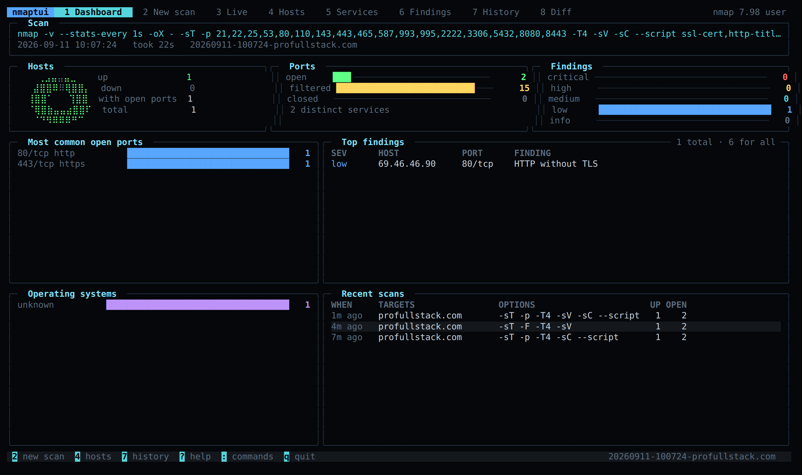
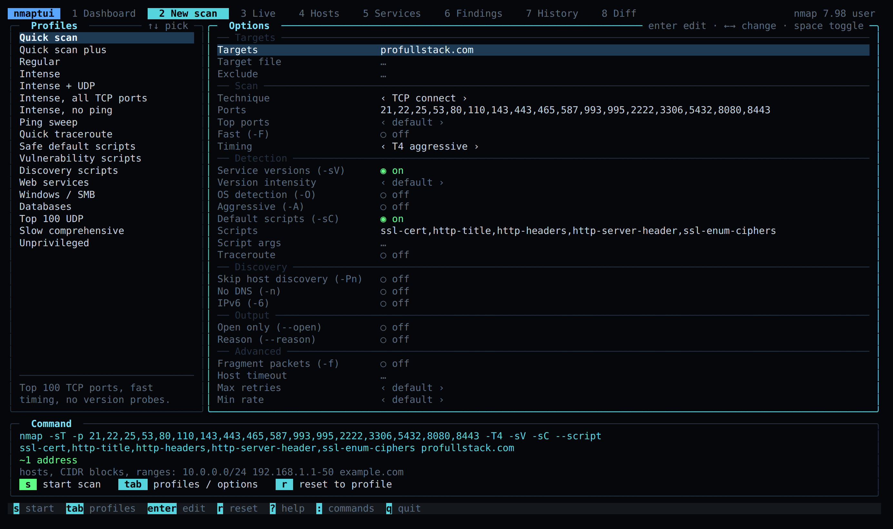
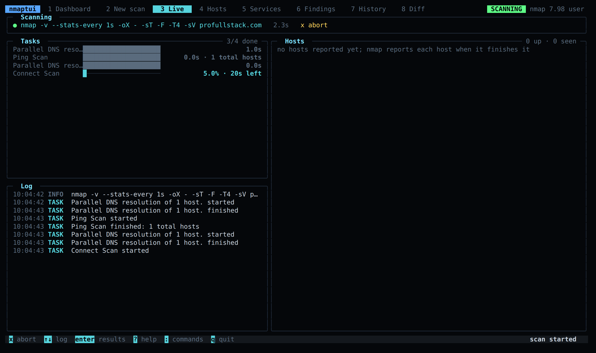
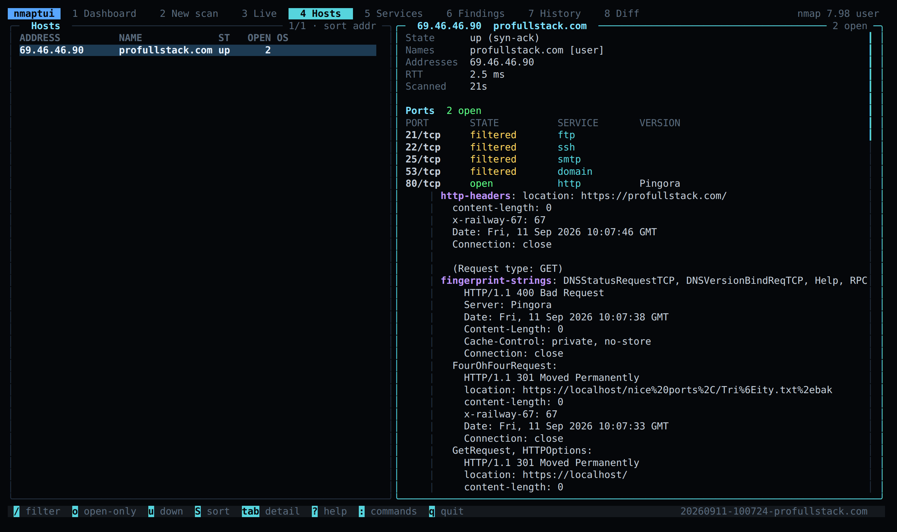
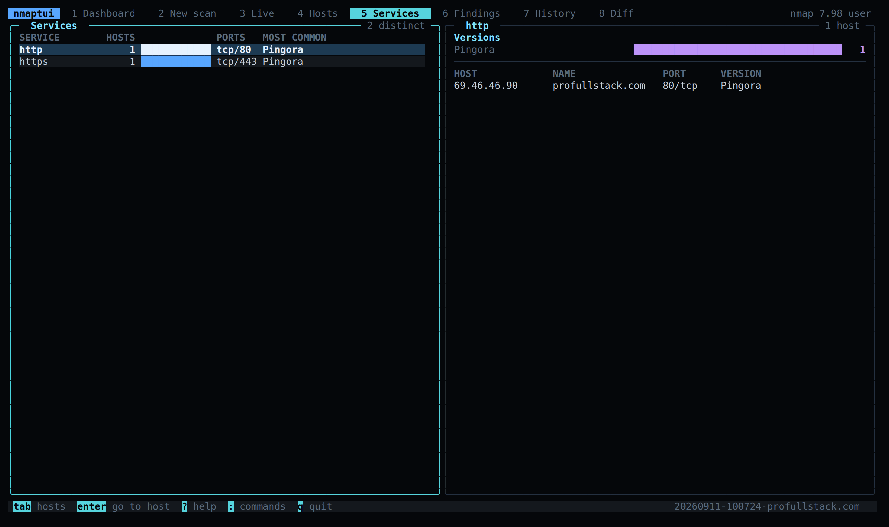
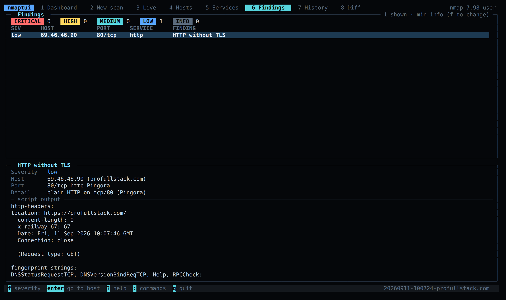
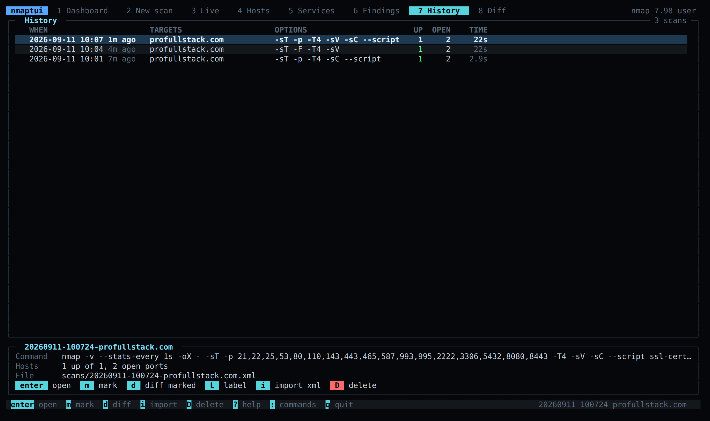
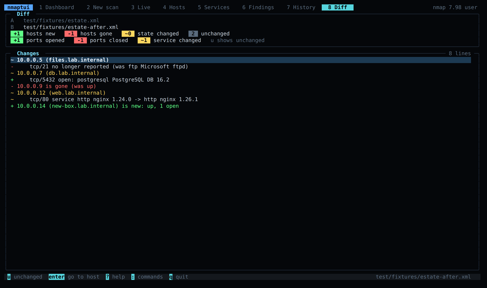
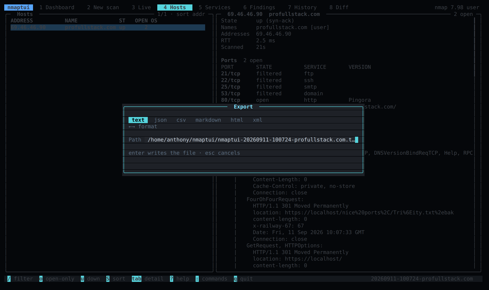
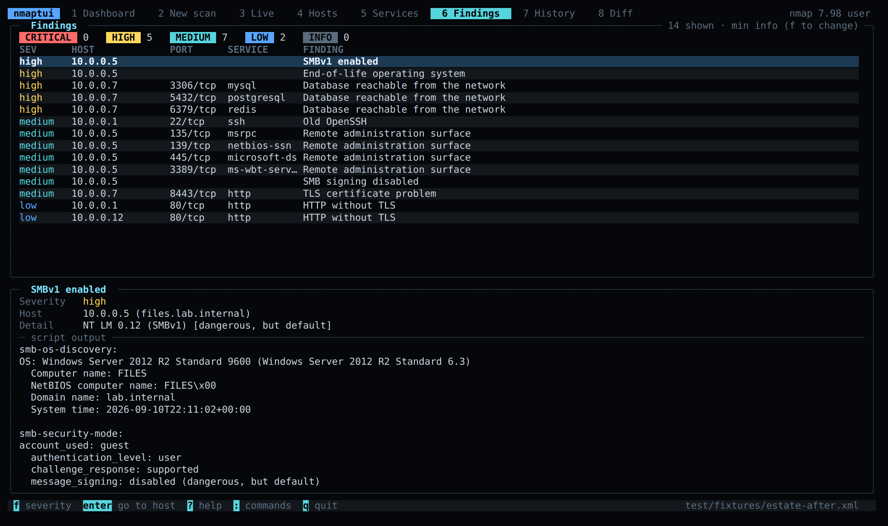

# nmaptui

An admin console for nmap in the terminal. Build scans from profiles, watch them run live, browse hosts and services, triage findings, diff scans over time and export reports. Bun and Node, zero dependencies beyond [HQTUI](https://hqtui.com).

[](https://www.npmjs.com/package/@profullstack/nmaptui)
[](https://github.com/profullstack/nmaptui/actions/workflows/ci.yml)
[](LICENSE)



**Demo video:** [watch nmaptui on nixamp](https://nixamp.com/?url=https%3A%2F%2Fserver1.chovy.nixamp.com%3A4321%2Fview%2FJV5m_XbnQFD0K9_JEnGEXw&play=track%3A5700)

## Install

```sh
curl -fsSL https://raw.githubusercontent.com/profullstack/nmaptui/main/install.sh | sh
```

That installs the published package under `~/.local` with npm (or bun when there is no node) and puts `nmaptui` on `~/.local/bin`. It never asks for root, and a second run upgrades. Later, `nmaptui update` and `nmaptui uninstall` do what they say.

Any of these work too:

```sh
npx @profullstack/nmaptui
bunx @profullstack/nmaptui
pnpm dlx @profullstack/nmaptui
npm install -g @profullstack/nmaptui
```

You need [nmap](https://nmap.org) on PATH to scan (`apt install nmap`, `brew install nmap`). Opening, diffing and exporting saved XML works without it. SYN, UDP and OS detection need raw sockets: run as root, pass `--sudo` (uses `sudo -n`, so `sudo -v` first), or pick the TCP connect technique, which works for anyone.

## Quick start

```sh
nmaptui                              # open the console
nmaptui 10.0.0.0/24                  # builder pre-filled with a target
nmaptui 10.0.0.0/24 -P intense --start   # pick a profile and go
nmaptui open scan.xml                # browse any nmap -oX file
nmaptui diff before.xml after.xml    # what changed
nmaptui print scan.xml --format md   # a report on stdout
```

Keys: `1`-`8` switch screens, `?` lists every key, `:` opens the command palette, `e` exports, `q` quits.

Every technique and profile, with the exact nmap command each one runs and worked examples, is in **[docs/scan-types.md](docs/scan-types.md)**.

## Screens

### New scan

Eighteen profiles down the left (Quick, Intense, Ping sweep, Vulnerability scripts, Web services, Windows / SMB, Databases, Top 100 UDP and so on; all listed in [docs/scan-types.md](docs/scan-types.md)). Every nmap option that matters on the right, grouped and explained one line at a time. The exact command nmap will get is always underneath, with an address count for the targets you typed and a warning when the scan needs root.



### Live

nmap's XML is read as it streams, so each task shows up as it begins, with nmap's own percent and time remaining once it reports them, and every finished host lands in the table on the right while the rest are still being probed. `x` aborts and keeps what came back.



### Hosts

Every host with its name, state, open port count and OS family. The detail pane has addresses, OS matches with accuracy, uptime, hop distance, round trip time, every port with product and version, script output, traceroute and CPEs. `/` filters on anything, including port numbers and banners. `o` hides hosts with nothing open, `u` shows the ones that were down, `S` cycles the sort.



### Services

The same scan pivoted by what is listening: how many hosts run each service, on which ports, and the version spread. This is where "which boxes still run OpenSSH 7" gets answered.



### Findings

A triage list built from rules over the scan: NSE `VULNERABLE` output, clear-text protocols, anonymous FTP, SMBv1 and unsigned SMB, databases and remote admin ports on the network, expired or self-signed certificates, weak TLS, old OpenSSH, end-of-life operating systems, open proxies and relays. Each one points at a host and port with the reason. `f` sets the minimum severity, `enter` jumps to the host.



### History and diff

Every scan you run is kept, with its XML, under `~/.local/share/nmaptui` (or `$XDG_DATA_HOME/nmaptui`, or `NMAPTUI_DATA_DIR`). Reopen one, label it, import a file made elsewhere with `nmap -oX`, or mark two and diff them: hosts that appeared or vanished, ports that opened or closed, services whose version moved.





### Export

Text, JSON, CSV, Markdown, HTML or the raw XML, from the `e` dialog or `nmaptui print`.



### A larger estate

The findings and dashboard on a lab network with a legacy Windows file server, exposed databases and a switch that still answers on telnet:



## Command line

```
nmaptui [targets...] [options]        open the console, targets pre-filled
nmaptui open <scan.xml>               browse an nmap -oX file
nmaptui diff <before.xml> <after.xml> what changed between two scans
nmaptui print <scan.xml> [--format f] write a report to stdout and exit
nmaptui import <scan.xml> [label]     add an nmap -oX file to the history
nmaptui history                       list saved scans
nmaptui profiles                      list scan profiles and their flags
nmaptui update                        upgrade to the latest release
nmaptui uninstall                     remove nmaptui (scans and history are kept)

-P, --profile <id>    Start from a profile (see: nmaptui profiles)
-p, --ports <spec>    Port spec, e.g. 22,80,443 or 1-65535
    --top-ports <n>   Scan the n most common ports
-T<0-5>               Timing template
-sT | -sS | -sU | -sn Technique: connect, SYN, UDP, ping sweep
-sV / --no-version    Version detection on (default) / off
-sC, --script <expr>  Default scripts / an NSE script expression
-O, -A, -Pn, -n       OS detection, aggressive, skip ping, no DNS
-iL <file>            Read targets from a file
    --start           Start the scan immediately
    --sudo            Run nmap through sudo -n for raw-socket scans
    --nmap <path>     nmap binary to use
    --format <f>      print: text, json, csv, markdown, html, xml
-o, --output <file>   print: write to a file instead of stdout
    --data-dir <dir>  Where scans are kept
-t, --theme <name>    Color theme
-c, --collapse        Merge adjacent panel borders
-M, --no-mouse        Disable mouse tracking
    --json            history/profiles: machine-readable output
```

Scan techniques, profiles and example invocations: [docs/scan-types.md](docs/scan-types.md).

`print` and `diff` work in pipes and cron jobs, so a nightly `nmaptui diff last.xml tonight.xml` in a mail is a few lines of shell.

## Library

The parser, model, diff, findings and reports are importable without the UI:

```ts
import { parseXml, fromElement, findings, diffScans, textReport } from "@profullstack/nmaptui";

const scan = fromElement(parseXml(xml));
for (const f of findings(scan)) console.log(f.severity, f.host.addr, f.title);
```

`XmlStream` hands over each `<host>` and task event as nmap writes them, which is how the live screen works; `runScan` wraps the spawn.

## Development

```sh
bun install
bun run typecheck
npm test            # node --test, straight off the .ts sources
bun test test/
bun run build
node bin/nmaptui.mjs open test/fixtures/estate.xml
```

Screens render headlessly with `renderToText` from HQTUI, so the UI tests assert on the actual frames.

## License

MIT. Built by [Profullstack](https://profullstack.com) on [HQTUI](https://hqtui.com).
